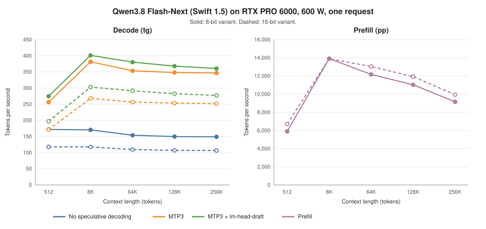

# NInfer 6000

NInfer 6000 runs Qwen3.8 Flash-Next 125B-A6B on one NVIDIA RTX PRO 6000 Blackwell GPU.

It is a fork of [NInfer](https://github.com/Neroued/ninfer), a C++/CUDA inference engine for
single Blackwell GPUs. This fork adds the following Flash-Next features:

- an 8-bit weight option;
- an 8-bit PLE table option;
- kernel optimizations for decode and MTP speculative decoding.

For build requirements, CLI and HTTP usage, Docker and the general architecture, refer to the
[NInfer README](https://github.com/Neroued/ninfer#readme) and the [documentation index](docs/README.md).
These instructions also apply to this fork.

## Performance



These measurements use one request, BF16 KV, CUDA Graphs, greedy sampling and an 8,192-token
prefill chunk. The model is Swift 1.5. The GPU power limit is 600 W. Both variants use the same
build.

### Decode

Without speculative decoding:

| Context | 16-bit | 8-bit | Change |
|---:|---:|---:|---:|
| 512 | 118.0 tok/s | 172.0 tok/s | +46% |
| 8K | 117.8 tok/s | 170.6 tok/s | +45% |
| 64K | 109.7 tok/s | 153.9 tok/s | +40% |
| 128K | 107.2 tok/s | 149.8 tok/s | +40% |
| 256K (maximum) | 106.6 tok/s | 149.0 tok/s | +40% |

MTP3:

| Context | 16-bit | 8-bit | Change |
|---:|---:|---:|---:|
| 512 | 171.1 tok/s | 256.2 tok/s | +50% |
| 8K | 268.2 tok/s | 381.5 tok/s | +42% |
| 64K | 256.6 tok/s | 353.5 tok/s | +38% |
| 128K | 253.5 tok/s | 348.1 tok/s | +37% |
| 256K (maximum) | 251.7 tok/s | 346.8 tok/s | +38% |

MTP3 with `--lm-head-draft`:

| Context | 16-bit | 8-bit | Change |
|---:|---:|---:|---:|
| 512 | 197.1 tok/s | 274.8 tok/s | +39% |
| 8K | 303.1 tok/s | 401.3 tok/s | +32% |
| 64K | 291.7 tok/s | 380.3 tok/s | +30% |
| 128K | 282.6 tok/s | 368.0 tok/s | +30% |
| 256K (maximum) | 277.4 tok/s | 360.6 tok/s | +30% |

### Prefill

| Prompt length | 16-bit | 8-bit | Change |
|---:|---:|---:|---:|
| 512 | 6,709 tok/s | 5,905 tok/s | -12% |
| 8K | 13,903 tok/s | 13,908 tok/s | 0% |
| 64K | 13,043 tok/s | 12,171 tok/s | -7% |
| 128K | 11,927 tok/s | 11,032 tok/s | -8% |
| 256K (maximum) | 9,941 tok/s | 9,154 tok/s | -8% |

The 256K row uses a 261,632-token prompt and 256 generated tokens, which is the 262,144-token
maximum context. The other rows generate 256 tokens after a prompt of the given length.

The 16-bit variant has BF16 non-expert weights and a BF16 PLE table. The 8-bit variant has FP8
non-expert weights and an FP8 PLE table. Both variants use NVFP4 routed experts.

`--lm-head-draft` makes the MTP drafter use a smaller, quantized proposal head. It increases MTP3
decode by 4% to 15%.

MTP3 throughput depends on the text. The benchmark text accepts 2.5 to 2.6 tokens per
verification round at 512 context and 3.9 to 4.0 at 8K and longer. The long prompts repeat the
same text, so they give high acceptance. Typical text gives lower MTP3 throughput.

### Power limit

The 8-bit variant at 450 W and at 600 W:

| Measurement | 450 W | 600 W |
|---|---:|---:|
| Decode without speculative decoding, 8K | 171.6 tok/s | 170.6 tok/s |
| Decode with MTP3, 8K | 390.8 tok/s | 401.3 tok/s |
| Prefill, 8,192 tokens | 12,104 tok/s | 13,908 tok/s |

Decode is limited by memory bandwidth, so the power limit has almost no effect. Prefill is faster
at 600 W.

### Benchmark command

```bash
./build/bench/ninfer_bench \
  --weights out/v3/swift_1_5_qwen3_8_flash_next_nvfp4_fp8ple_fp8proj.ninfer \
  --corpus bench/fixtures/qwen3_8_flash_next_context.ids \
  -pg "512,256;8192,256" --max-ctx 9216 --prefill-chunk 8192 --kv-dtype bf16 \
  --spec mtp --draft-tokens 3 --lm-head-draft --warmup 1 -r 2
```

The benchmark binary is in the `dev` preset. Remove the `--spec`, `--draft-tokens` and
`--lm-head-draft` options to measure decode without speculative decoding.

For the long-context rows, use `-pg "65536,256;131072,256" --max-ctx 131584` or
`-pg "261632,256" --max-ctx 262144`.

## Target system

| Item | Value |
|---|---|
| GPU | RTX PRO 6000 Blackwell Workstation Edition, 96 GB |
| GPU power limit | 600 W |
| Host memory | 64 to 128 GB |
| CUDA | 13.x, `sm_120a` |
| Operating system | 64-bit Linux |

The engine reads the PLE table directly from the artifact file. Use fast local storage. Keep the
table in the page cache for the best prefill and decode speed. An 8-bit PLE table is 51 GB. A
128 GB host keeps all of it in the page cache. A 64 GB host keeps part of it, and the other rows
are read from storage when they are used.

## Model variants

The converter accepts two source checkpoints. Both store the routed experts as NVFP4.

| Source profile | Hugging Face checkpoint | Source PLE table |
|---|---|---|
| `radixark` (default) | [RadixArk/Qwen3.8-Flash-Next-NVFP4](https://huggingface.co/RadixArk/Qwen3.8-Flash-Next-NVFP4) | FP8, 51 GB |
| `swift` | [ukisai/Swift-1.5-Qwen3.8-Flash-Next-NVFP4](https://huggingface.co/ukisai/Swift-1.5-Qwen3.8-Flash-Next-NVFP4) | BF16, 102 GB |

## Conversion options

The converter has two optional 8-bit formats:

| Option | Effect |
|---|---|
| `--ple-format fp8_e4m3fn` | Re-encodes a BF16 PLE table as FP8 E4M3 with one BF16 scale. Applies to `swift` only. |
| `--projection-format fp8_e4m3fn_row_bf16` | Stores 510 non-expert matrices as FP8 E4M3 with one BF16 scale per row. Activations stay BF16. |

The FP8 projection option converts these matrices:

- attention q, k, v and o projections;
- GDN in_proj_qkv, in_proj_z and out_proj projections;
- the MoE router and the shared-expert gate and up projections;
- the HyperConnection Down and Up projections;
- the output head;
- the MTP drafter projections.

The routed experts stay NVFP4. The indexer, the GDN control weights, the shared-expert down
projection and the MTP experts stay BF16.

The output file name is fixed for each set of options. The converter rejects other names.

| Profile | Options | Output file | Size |
|---|---|---|---:|
| `radixark` | none | `qwen3_8_flash_next_125b_a6b_nvfp4.ninfer` | 134.8 GB |
| `swift` | none | `swift_1_5_qwen3_8_flash_next_nvfp4.ninfer` | 186.0 GB |
| `swift` | both 8-bit options | `swift_1_5_qwen3_8_flash_next_nvfp4_fp8ple_fp8proj.ninfer` | 130.5 GB |

The `radixark` profile with `--projection-format` adds `_fp8proj` to the name. The `swift`
profile with only `--ple-format` adds `_fp8ple`.
We measured only the Swift 8-bit combination. The other combinations are not measured.

Convert Swift 1.5 with both 8-bit options:

```bash
python3 -m tools.convert.qwen3_8_flash_next_125b_a6b.convert \
  --model /path/to/Swift-1.5-Qwen3.8-Flash-Next-NVFP4 \
  --source-profile swift \
  --ple-format fp8_e4m3fn \
  --projection-format fp8_e4m3fn_row_bf16 \
  --out out/v3/swift_1_5_qwen3_8_flash_next_nvfp4_fp8ple_fp8proj.ninfer \
  --device cuda
```

The conversion takes approximately 7 minutes. The writer does not overwrite an existing artifact.
Keep the entry file and all `.part-NNNN` files together. The
[artifact reference](docs/maintainer/qwen3.8-flash-next-125b-a6b-artifact.md) gives the complete
inventory and binding rules.

### Quality of the 8-bit variant

We compared the 8-bit Swift artifact with the BF16 Swift artifact on six oracle prompts:

- The mean log-probability change of the generated tokens is 0.003 to 0.086.
- The perplexity changes by -2.4% to +1.7%.
- Greedy generation changes only at near-tie tokens.

## Build

```bash
git clone https://github.com/lkarlslund/ninfer6000.git
cd ninfer6000
cmake -S . -B build -G Ninja -DCMAKE_BUILD_TYPE=Release
cmake --build build -j
```

## Serve

This command starts an OpenAI- and Anthropic-compatible server with MTP3 and Vision:

```bash
./build/apps/ninfer-serve out/v3/swift_1_5_qwen3_8_flash_next_nvfp4_fp8ple_fp8proj.ninfer \
  --host 0.0.0.0 --port 8003 \
  --model-id Qwen/Qwen3.8-Flash-Next \
  --max-context 196608 --kv-capacity auto --kv-dtype bf16 \
  --max-concurrency 2 \
  --device-state-slots 2 --host-state-slots 8 --host-kv-mib 16384 \
  --spec mtp --draft-tokens 3 --lm-head-draft \
  --vision --preserve-thinking \
  --prefill-chunk 8192
```

`--kv-capacity auto` gives all free GPU memory to the KV cache. The cache size is limited to
`--max-context` multiplied by `--max-concurrency`. Thus, smaller weights give more KV capacity
but do not decrease the total GPU memory use.

## License

NInfer is licensed under the [Apache License 2.0](LICENSE). The model weights have their own
licenses. Refer to the source checkpoints on Hugging Face. Vendored dependencies keep their license
files under `third_party/`.
