# NInfer design overview and code walkthrough

Reverse-engineered design record for this repository (`baristahaus/ninfer-gb10`). It explains how the
code is organised, how a request travels through it, how state and memory are owned, and what this
fork changed relative to upstream. It is written so that another inference engine can later be
compared with it axis by axis (see [Section 15](#15-comparison-worksheet)).

- **As of:** 2026-09-30, branch `claude/brave-pasteur-hcmpip`, base commit `7b4c7fe`.
- **Method:** derived from reading the source and the maintainer references listed in
  [Section 17](#17-sources-and-evidence-status). Nothing was built or run for this document, and no
  measurement in it was taken by its author. Every number is quoted from a repository document and is
  attributed to it.
- **Authority:** this is an explanatory map, not a normative contract. Where it disagrees with the
  references in `docs/maintainer/`, the references win; known disagreements are listed in
  [Section 16](#16-open-questions-and-things-not-verified).

---

## 1. Executive summary

### 1.1 What NInfer is

NInfer is a from-scratch C++20/CUDA inference engine that is deliberately **not general**. It runs a
closed set of Qwen models on **one Blackwell GPU with one resident model**, and specialises everything
(kernels, state layouts, schedules, CUDA graphs) for that set instead of interpreting a model graph.

| Family | Models | Structure | Target hardware (upstream) |
|---|---|---|---|
| Qwen3.5 | 27B dense, 35B-A3B MoE (Qwen3.6 / Qwen3.8 checkpoints) | Gated attention + Gated DeltaNet (GDN) hybrid, optional Vision, MTP, DFlash/DFlash2 | RTX 5090 (`sm_120a`) |
| Qwen3.8 Flash-Next | 125B-A6B, fixed dimensions | 48 layers (12 QSA attention + 36 GDN), 512-expert MoE, 4-stream HyperConnection, PLE, Vision, MTP | RTX PRO 6000 (`sm_120a`) |

**This fork** ports the whole stack to **GB10** (`sm_121a`, 48 SMs, one unified LPDDR5X pool) and then
optimises the Flash-Next path for that machine (dense FP8 weights, cheaper MTP layer, unified-memory
aware start-up sizing, yield-style synchronisation, JSON/tool-call serving).

### 1.2 The design in ten sentences

1. **One public Engine.** CLI, HTTP server and benchmarks all call the same `ninfer::Engine` (`include/ninfer/engine.h`); there is no second inference route.
2. **Four layers on the request path:** Gateway (protocol) → Frontend (tokenizer, template, output semantics) → Engine (order, admission, publication) → Program (physical execution and state).
3. **Single mutation owner.** One worker thread mutates all request, scheduler, resource and GPU state; every other thread talks to it through a queue, an atomic cancel flag and a per-request event.
4. **Fixed workload model.** 1–8 active requests fixed at start-up, a bounded FIFO queue, **no preemption**, and one **exact-B compact decode batch** per round.
5. **Everything big is allocated once.** Weights, paged KV pools, state slots, workspace and CUDA graphs exist before the first request; runtime only changes ownership and mapping.
6. **Artifacts, not checkpoints.** A v3 `.ninfer` file carries config, already-encoded weight objects, logical bindings and frontend resources; loading copies bytes and never repacks.
7. **Ownership split for context reuse.** Scheduler decides *who runs*; ResourceManager decides *what logical context to keep*; Program decides *what is physically possible*. A reusable checkpoint is KV **plus** full recurrent state at an exact token frontier.
8. **Two commit transactions.** Resource transitions (admission, capture, retain/release) and model-unit transactions (`PendingBatch` → one `commit` or `abort`). Output becomes visible only after the model state has committed.
9. **Speculation is internal to Program.** MTP (Flash-Next, Qwen3.5) and DFlash (Qwen3.5 only) never change scheduling; GDN state is made rollback-safe with ReplaySSM (record raw inputs during verify, replay only the accepted prefix).
10. **Correctness by oracle.** Every Op is qualified against an independent naive FP32/FP64 oracle at real model shapes; performance claims are tied to a scope (op, schedule, request phase, end-to-end).

### 1.3 Where the time and bytes go (Flash-Next on GB10, from the fork's plan)

Decode is **memory-bandwidth bound**. The fork's memory probe measured 246 GB/s streaming read (spec:
273 GB/s). Bytes read per decoded token, from the binding shapes:

| Weights (BF16-dense profile) | Bytes per token |
|---|---:|
| GDN projections (36 layers) | ~4.2 GB |
| Full attention (12 layers) | ~1.2 GB |
| HyperConnection (two per layer) | ~1.3 GB |
| `lm_head` | ~1.3 GB |
| Router + shared expert | ~0.6 GB |
| Routed experts (NVFP4, 10 of 512 per layer) | ~1.3 GB |
| **Total** | **~9.9 GB** (ceiling ≈ 25 tok/s at 246 GB/s) |

Moving the dense projections to FP8 (recipe "7a") cuts this to about 5.6 GB (ceiling ≈ 44 tok/s). The
fork's measured single-stream decode-only rates on its adopted artifact were 31–33 tok/s without
speculation and 47.0 tok/s with MTP K=3 on served text (57.9 on the bench's natural corpus); see
[Section 13](#13-gb10-fork-status-and-measured-results) for provenance and caveats.

### 1.4 Distinguishing choices at a glance

| Axis | NInfer's position |
|---|---|
| Model coverage | Closed Qwen3.5 / Flash-Next set; no generic graph, no plugin registry |
| Hardware coverage | One GPU; `sm_120a` and `sm_121a` only; CMake rejects other architectures |
| Batching | ≤ 8 lanes, FIFO, non-preemptive, one prefill chunk *or* one decode round per unit, alternating |
| KV cache | Paged (64-token pages), typed pools, shared across lanes and retained prefixes, Device + pinned Host replicas |
| Prefix reuse | Exact-frontier checkpoints (KV + StateImage + backend state), cost-model-planned retention |
| Speculation | MTP (in-model), DFlash/DFlash2 (Qwen3.5); acceptance verified against target in the same round |
| Graphs | CUDA Graphs per exact batch size B |
| Quantisation | Encoded in the artifact (Q4–Q8 groupwise, FP8 row, NVFP4, BF16); Ops consume the encoding directly |
| API | OpenAI Chat Completions + Responses, Anthropic Messages; tool calls parsed, not executed; no constrained decoding |
| Verification | Per-Op independent oracle; real-artifact tests; serve batteries |

---

## 2. Lineage and what this fork changed

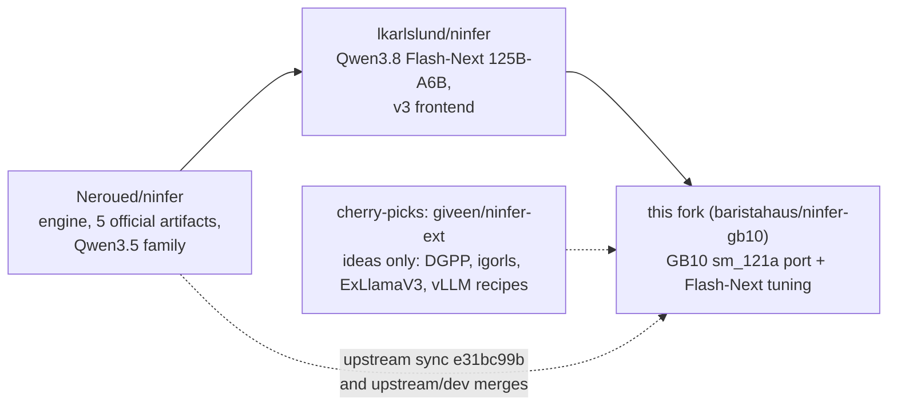

Upstream contributions are described in `README.md`; the fork's own additions, grouped by theme:

| Theme | Change | Where |
|---|---|---|
| Architecture gate | `sm_121a` accepted next to `sm_120a` (CMake and runtime) | `CMakeLists.txt`, `src/core/device.cu` |
| Launch sizing | Launch constants derived from the 5090's 170 SMs replaced by a queried SM count (cached; 170 fallback). Persistent-grid kernels stride by `gridDim.x`, so grid size is performance-only | `src/ops/common/device_info.*`; ~20 files use `device_sm_count()` / `multiprocessor_count` |
| Converter I/O | Safetensors read in chunks (Linux caps one `read` just under 2 GiB) | `tools/convert` |
| Synchronisation | `NINFER_CUDA_SYNC` unset → **yield** on integrated devices, **spin** on discrete; explicit `spin\|blocking\|yield\|auto` accepted | `src/core/device.cu` |
| Unified-memory sizing | On integrated devices the start-up budget is `MemAvailable` minus a 6 GiB reserve minus pinned Host KV, because `cudaMemGetInfo` under-reports memory reclaimable from the page cache | `src/runtime/engine/model_instance.cpp` |
| Dense FP8 profile ("7a") | Re-encoder from the existing artifact; FP8 A16 routes; fused FP8 HyperConnection/QSA decode forms; FP8 MTP rescoring; MTP experts as NVFP4 | `tools/convert/qwen3_8_flash_next_125b_a6b`, `src/ops`, binder |
| Serving | `response_format` (`text\|json_object\|json_schema`) and `tool_choice` are **prompt-guided**; `json_output::extract` cleans the output. `ignore_eos`, stable shared-prefix publication, directive placement on the final turn | `src/serve/json_output.h`, `src/serve/*` |
| Robustness | Worker OOM recovery (retryable `Overloaded`), post-OOM admission backoff, MTP RoPE-layout fix for batch ≥ 3, no-speculation graph fix (`fill_i32` valid columns) | `src/runtime/engine/engine_core.h`, `text_context_impl.h` |
| Tooling | `tools/gb10/` step scripts, probes (memory, page residency, sync), campaign drivers, telemetry | `tools/gb10/`, `tools/bench/hardware/gb10.json` |
| Plan and record | Working plan with campaign results | `docs/maintainer/plan-2026-09-gb10.md` (temporary by its own rule) |

Repository size for orientation (`.cpp/.cu/.h/.cuh/.py/.sh`, this checkout): `src/ops` ≈ 75.5 kLOC in 690
files; `src/models` ≈ 79 kLOC in 184 files; `tests` ≈ 54 kLOC; `tools` ≈ 26 kLOC; `bench` ≈ 22 kLOC;
`src/serve` ≈ 11.6 kLOC; `src/runtime` ≈ 11.4 kLOC; `src/core` ≈ 5.6 kLOC; `src/artifact` ≈ 1.7 kLOC.

---

## 3. System map

### 3.1 Layers and ownership

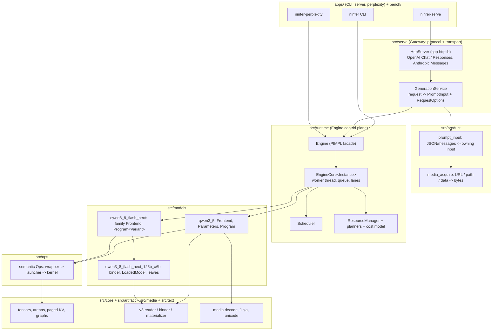

The rule that shapes the code: **each fact has exactly one owner** and other components read published
summaries instead of keeping mirrors.

| Fact / decision | Owner |
|---|---|
| Config, bindings, Uses, weight backing | `Model` (immutable after load) |
| Protocol, connection, transport, HTTP errors | Gateway (`src/serve`) |
| Prompt and output semantics (template, thinking/content, stop, tool parse, MRoPE) | Frontend |
| Waiting queue, request record, response event, availability | `EngineCore` |
| FIFO head, backfill, prefill-vs-decode order, round membership | `Scheduler` |
| Logical lanes, checkpoint catalog, session index, retention policy | `ResourceManager` |
| Physical State/KV, reservations, placement, feasibility, model state | `Program` |

### 3.2 Build targets and dependency direction

Static libraries (from `src/*/CMakeLists.txt`): `ninfer_core`, `ninfer_artifact`, `ninfer_ops`,
`ninfer_nvfp4_non_rdc`, `ninfer_model_loading`, `ninfer_model_runtime`, `ninfer_engine` (alias
`ninfer::engine`), `ninfer_runtime_support`, `ninfer_serve`, `ninfer_media_decode`,
`ninfer_media_acquire`, `ninfer_product_prompt_input`, `ninfer_product_logging`, `ninfer_text`.
Dependencies run one way: apps → serve/product → engine → models → ops → core/artifact. Ops never
include model headers; models call Ops through the contract headers in `include/ninfer/ops/`.
`NINFER_BUILD_APPS`, `BUILD_TESTING`, `NINFER_BUILD_BENCHMARKS` and `NINFER_PERFORMANCE_TRACE` are the
build switches. Ninja links are serialised (`ninfer_link` job pool, size 1).

---

## 4. Artifacts and start-up

### 4.1 The `.ninfer` v3 artifact

```text
entry file  (.ninfer)                  continuation volumes (.part-NNNN, ≤ 32 GB each by default)
┌──────────────────────────┐           ┌──────────────────────┐
│ 32-byte header           │           │ continuation header  │
│ file directory           │           │ payload slice        │
│ JSON master catalog ─────┼──┐        └──────────────────────┘
│ payload (logical offsets)│  │
└──────────────────────────┘  │   catalog:
                              ├─ components: text | vision | mtp | dflash | dflash2  (each with config)
                              ├─ objects:    tensor objects (format, layout, shape, aux) and resources
                              ├─ bindings:   logical parameter -> object range(s)   (two kinds)
                              ├─ uses:       one read of a parameter + activation permission (A16Only / AllowA8 / AllowA4)
                              ├─ resources:  frontend/{tokenizer.json, chat_template.jinja, ...}
                              └─ metadata / provenance (descriptive only; never selects execution)
```

Properties that matter for design comparison:

- **Weights arrive pre-encoded.** The converter (`tools/convert/<target>`) does source mapping,
  quantisation or value-preserving import, fusion, packing and layout conversion. The loader validates
  and uploads original bytes; there is **no runtime weight repacking**.
- **Execution is selected by architecture + config + actual bindings**, not by file name or `model_id`.
  The same model code therefore runs a Q4/Q5 mixed artifact, an FP8 or an NVFP4 one, provided a consumer
  Op exists for each binding.
- **Shared objects are stored once**, with independent Uses. A Use's activation permission set is
  intersected across a fused call.
- **Only selected components are bound and materialised** (Text is required; Vision, MTP, DFlash are
  optional). For Flash-Next, Text alone selects 1,260 device objects; MTP adds 31, Vision 333, the
  optimised proposal head 2.
- **The Flash-Next PLE table is the only file-mapped tensor**: 320,001,536 × 160 FP8 (≈ 51.2 GB), exposed as
  a read-only mapping across payload shards. Only the rows a chunk needs are gathered on the host and sent
  to the device; the table is never uploaded.
- Python (`tools/artifact`) reads and writes the same container; C++ (`src/artifact`) has the generic
  reader, binder primitives and materializer. Neither owns checkpoint execution semantics.

### 4.2 Start-up sequence (Flash-Next path, from `construct_flash_next`)

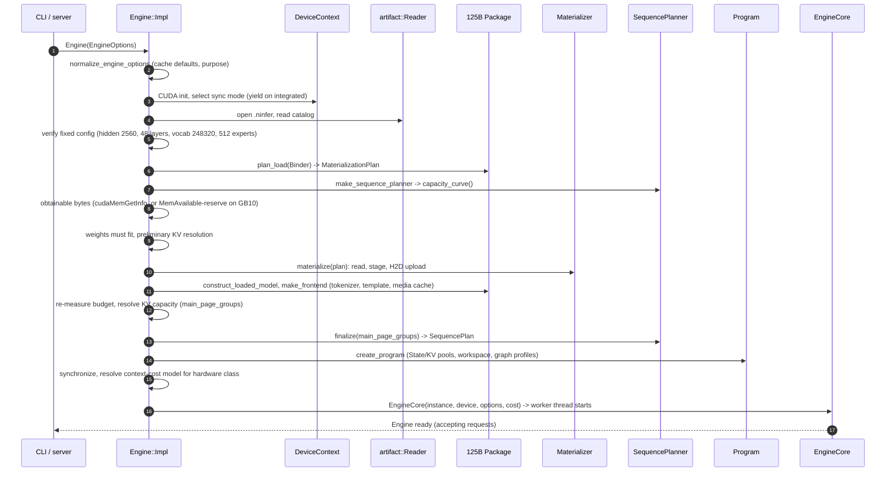

The Qwen3.5 path (`construct_model`) has the same shape with different pieces: `plan_load` →
`materialize_model` → `ModelInstance` (Model + const `Parameters` + Frontend) → `prefill_signature` and
context cost → `make_sequence_planner` → resolve KV → `create_program`. Both families finish with the same
`ConstructedModel {instance, LoadSummary, ContextMachineCostModel}`, held in an
`std::variant<unique_ptr<ModelInstance>, unique_ptr<FlashNextInstance>>`.

**KV capacity resolution.** The planner exposes an affine `SequenceCapacityCurve` (bytes as a function
of page-group count `M`). `M` ranges from `max(⌈S/64⌉, C)` (one full-length request, one page per lane) to
`C·⌈S/64⌉` (all lanes at the ceiling), where `S = max_context`, `C = max_concurrency`. An explicit
`--kv-capacity` rounds up to pages; `auto` takes the largest `M` fitting the remaining budget once weights
are resident. Capacity is fixed for the life of the process.

**Two engine purposes** share the public Engine: `Generation` (everything above) and `CausalScoring`
(offline perplexity: serial, temporary empty State/Main KV per window, no queue, no continuations, no
scheduler). They are chosen at start-up and never switch.

---

## 5. The models

### 5.1 Two families, deliberately not unified

`src/models/qwen3_5` and `src/models/qwen3_8_flash_next` are independent runtimes. Flash-Next does not
reuse or conditionally specialise the Qwen3.5 Program; the Engine selects between them once, at the closed
registry boundary (`models::resolve_architecture`), and carries the prepared prompt as an opaque
`std::variant<qwen3_5::PreparedPrompt, qwen3_8_flash_next::PreparedPrompt>`.

| | Qwen3.5 family | Flash-Next family |
|---|---|---|
| Program | Concrete classes under `program/{planning,transactions,storage,speculative}` | `Program<Variant>` template, header-heavy (`impl/runtime/*_impl.h`; `program_impl.h` ≈ 12.7 kLOC), instantiated by the 125B package |
| Exact dimensions | Read from config (`layer_types`, heads, experts) | Fixed in the 125B package; config only validated |
| Speculation | MTP, DFlash, DFlash2 | MTP (1–3 draft tokens); `supports_dflash = false` for the 125B variant |
| Extra state | Attention KV, GDN state | QSA KV + raw index keys + MRoPE positions, GDN state, PLE state, HyperConnection stream, MTP state |
| Weight parameters | `Parameters` derived from `Model` bindings | Three execution-leaf families: attention projection, GDN projection/control, post-mixer |
| Frontend | Own tokenizer, template, tool parser | Own copies; **registered artifact template only** (`--chat-template` rejected) |

`EngineCore<Instance>` is a **class template** instantiated for `ModelInstance` and `FlashNextInstance`; it
is duck-typed on `Instance::ModelContract` aliases (`Program`, `PreparedPrompt`, `PendingBatch`,
`SequenceHandle`, …). The control plane is therefore compile-time polymorphic, with no virtual dispatch
on the hot path.

### 5.2 Flash-Next 125B-A6B forward pass

Fixed dimensions (from the model reference): hidden 2560, 48 layers (full attention at layers
3, 7, …, 47; GDN elsewhere), vocab 248,320, 512 routed experts with 10 selected per token (expert width 640,
plus an independently gated shared expert), HyperConnection with 4 BF16 streams (10,240 rows), QSA 24 query
heads / 2 KV heads / head width 256, GDN 16 key heads / 48 value heads / width 128.

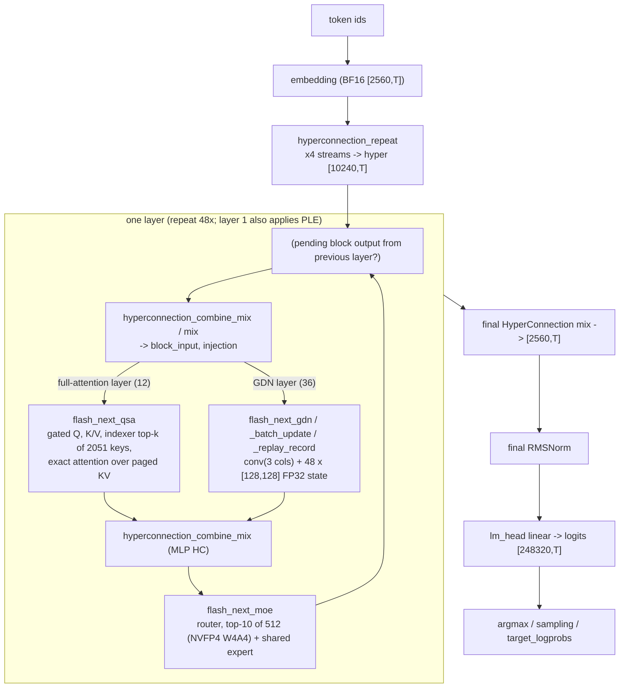

Points the code makes explicit (`TextContext::run_flash_next_layers`):

- A block's output is left **pending** and merged into the streams by the *next* combine step
  (`combine_mix` fuses "commit previous block" with "mix for the next"), which is why the schedule tracks a
  `pending` flag.
- **Phase** selects the state operation: `Prefill` uses chunked `flash_next_gdn`; verify with speculation uses
  `flash_next_gdn_replay_record` (records raw inputs, does not commit state); width-1 ordinary decode uses
  `flash_next_gdn_batch_update` (selected slot to slot). A direct multi-token state update is rejected.
- **PLE** (`has_ple` is `layer == 1` in the loader) reads 16 FP8 rows per token (8 bigram + 8 trigram
  hashed heads), keeps a nine-column causal state, and hashes reset at EOS (id 248044). It has a prefill form,
  a replay-record form and a batch-update form matching the GDN ones.
- All temporary tensors come from a **call-scoped workspace arena** (`work_.scope()`); nothing is heap
  allocated in the loop, which is what makes CUDA Graph capture legal.
- The layer schedule is written once and shared by prefill, decode and verify; only tensor geometry
  (`width × batch`), positions, valid-column masks and KV table rows differ.

### 5.3 Qwen3.5 family (short form)

Config-driven Dense or MoE stack of gated attention layers and GDN layers with zero-centred norms and
interleaved partial MRoPE; MoE adds routed SwiGLU experts and a gated shared expert. Optional components:
Vision tower, one-layer MTP predictor (conditioned on the final-normalised hidden state and the *next*
token), DFlash/DFlash2 companion draft models. The Attention/GDN weight *binding* variants (for example one
FP8 parent for Q/K/gate/V versus two Q4/Q5 parents) select which fixed Op call is made; the call order
itself is fixed in code.

### 5.4 Vision

Both families accept image, multi-image and video prompts. Preprocessing and MRoPE prompt construction are
Frontend work; the ViT tower (27 layers, hidden 1152 for Flash-Next) runs inside Program during prefill and
its output replaces media placeholder embeddings by scatter. Encoded-media digests take part in prefix
identity, and media fully inside a matched prefix skips the Vision encode on reuse.

---

## 6. Request lifecycle, end to end

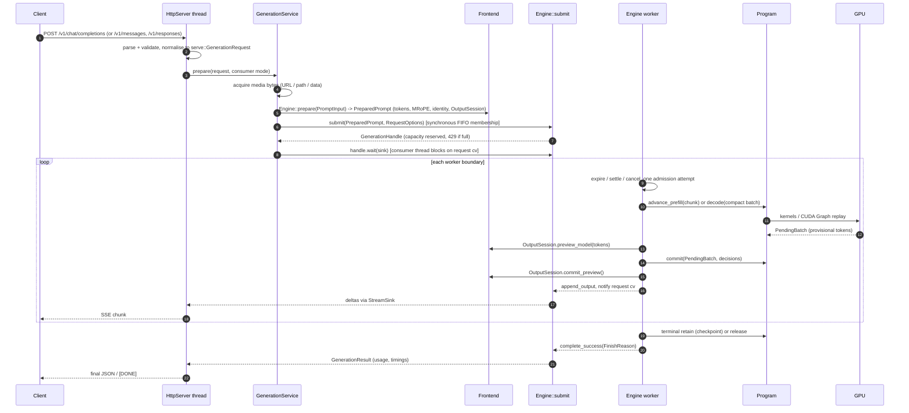

### 6.1 Threads and what each may touch

| Thread | Created by | May do | May not do |
|---|---|---|---|
| Engine worker (1) | `EngineCore` constructor, bound to the CUDA device | Mutate request records, Scheduler, ResourceManager, Program; launch all GPU work | Block on client I/O |
| HTTP request threads (`max_concurrency + max_pending + 1`) | cpp-httplib `ThreadPool` | Parse, prepare (tokenize, template, media), `submit`, `wait`, serialise output | Call Program; mutate model state |
| HTTP stats thread | `HttpServer` | Poll runtime stats for logs | — |
| Any consumer | — | Abandon a `GenerationHandle` (sets cancel + `consumer_released`) | Call Program from the abandoning thread |

Capacity accounting: outstanding requests are bounded by `max_concurrency + max_pending_requests`. A slot
is released only when **both** `response_done` (worker produced the final result or error) and
`consumer_released` (wait finished or handle dropped) hold, and only once (`capacity_released` guard). A
full queue yields HTTP 429 `server_overloaded`; the absolute `--pending-timeout-ms` deadline (started before
media acquisition) yields 503 `request_queue_timeout`.

### 6.2 Request state machine

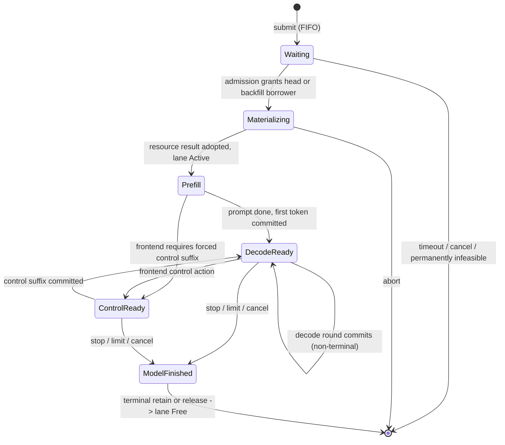

The `ResourceManager`'s lane view is the coarser `Free → Materializing → Active → TerminalPending → Free`.
Three identities are kept separate and never derive ownership from each other: the **lane** (long-lived
request position in the Engine), the **State/KV execution resource** (Program-allocated), and the **compact
row** (index inside one GPU unit).

---

## 7. The Engine control plane

### 7.1 The worker boundary

One iteration of `worker_loop` (from `engine_core.h`). Steps 1–4 run at every boundary; step 5 runs one
admission attempt at most; step 6 runs exactly one execution unit.

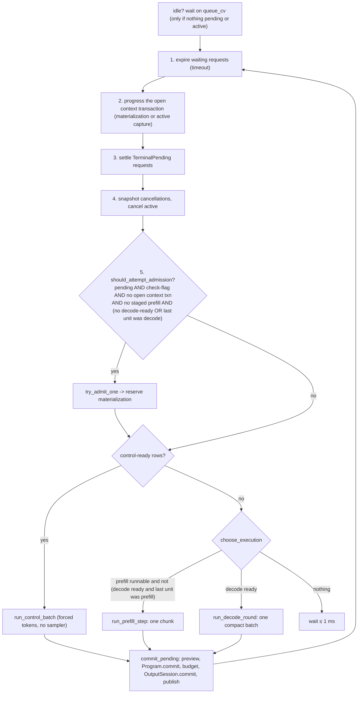

Consequences worth noting:

- **Strict alternation** between one prefill chunk and one decode round whenever both are runnable, so a
  long prompt neither starves decode nor is starved by it (`choose_execution`, `should_attempt_admission`).
- **At most one staged prefill** request exists at any time (`Scheduler::set_prefill_lane` throws on a
  second). Prefill is per-request and chunked (`prefill_chunk`, default 1024, must be a multiple of 128); decode is batched across all decode-ready lanes.
- Cancellation is **sampled once per unit** (`cancelled_at_unit_start`). A flag set while a GPU unit is in
  flight is seen at the next boundary; commit never re-reads it.
- Only the worker holds `execution_mutex_` while running a unit; the pending queue has its own
  `queue_mutex_`.

### 7.2 Admission, FIFO head protection and backfill

The Scheduler picks *which* waiting request may be tried (always the FIFO head first); the
ResourceManager then picks the cheapest legal source (root or an exact checkpoint) and end state for that
request; Program proves the physical plan. Resource conditions can never reorder the FIFO.

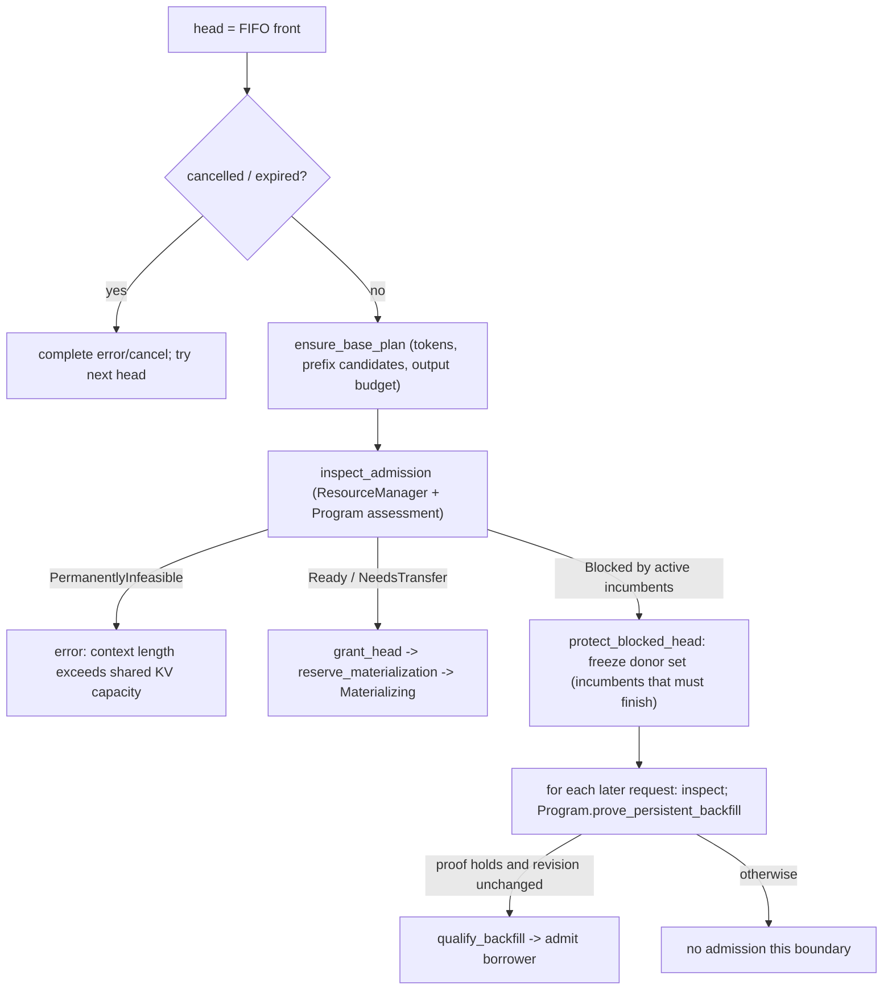

The backfill proof does **not** assume the borrower finishes first. It shows that, with the borrower holding
its full active reservation, the frozen donor set finishing is still enough for the head to be admitted at
root with every inactive cache released. Any transition that changes global topology advances
`resource_revision` and forces re-proof.

Admission also **reserves the whole prompt-plus-output page entitlement** up front; once Active, a request
cannot lose its ability to finish because another request or an inactive cache wanted the space.
`GenerationStart` (prompt and reused-prefix token counts) is published right after the admission choice
commits, before any prefill work.

### 7.3 The two commit transactions

**(a) Resource transition** — changes global ownership: materialize a waiting request, capture an active
checkpoint, retain/release at terminal, place or delete an inactive checkpoint.

```text
logical choice ──► Program seals ResourcePlan (bound to resource_revision)
               ──► RunningTransaction (staged copies, may span several boundaries)
               ──► ResourceResult (complete final state, also on abort)
               ──► ResourceManager adopts result ──► lane becomes visible
```

At most one global topology transition is open at a time. A stale plan can be re-planned with no side effect
before start; after start the source, victims and stage order cannot change.

**(b) Model-unit transaction** — one prefill finalisation, decode round or control step yields a move-only
`PendingBatch` (frozen membership, provisional tokens, per-row produced extent, per-row accepted-prefix
metadata, Program-owned provisional state). The Engine previews each row through the Frontend, forms the
accepted prefix, then calls exactly one `Program::commit` or `abort_pending`. Per non-cancelled row:
`1 ≤ accepted ≤ produced`, non-terminal ⇒ `accepted == produced`, terminal ⇒ any produced prefix. The commit
covers Main and backend KV, recurrent state, RNG and speculative state together.

Visibility order (verified in `commit_pending`):

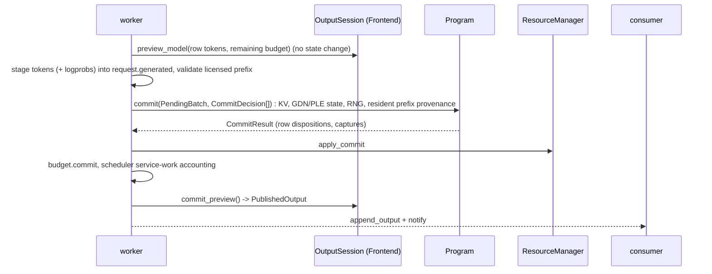

If the preview or staging fails, staged tokens are rolled back and the batch is aborted; if `Program::commit`
fails, the preview is not committed. A consumer therefore never sees a token the model state has not
committed.

### 7.4 Failure taxonomy

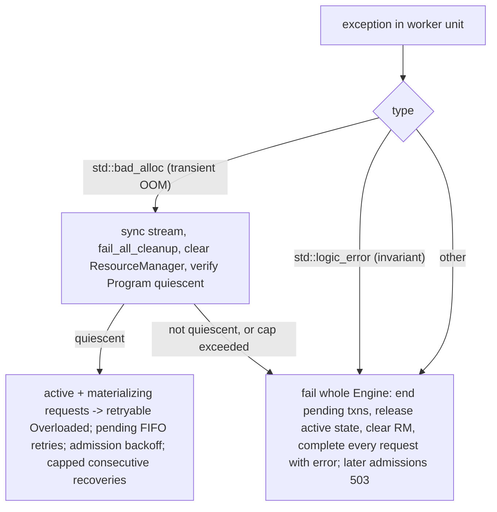

Request-local rejection (before any Program mutation): queue timeout, overload, waiting-cancel, input beyond
context contract, unrepresentable request, or a request infeasible even at root with all inactive cache
released. Internal invariant errors are never downgraded to a cache miss or retry.

---

## 8. Resources, KV and context reuse

### 8.1 Physical model

```text
Device memory (per process, fixed at start-up)
├─ weights                                  (immutable, one copy, from artifact)
├─ paged KV pools (typed, homogeneous)      Main Text  [+ MTP]  [+ Draft Full for DFlash with full layers]
│    page = 64 tokens; page group = all planes of one frontier; page IDs per pool
│    per-sequence address space = block table -> page IDs (not physically contiguous, not lane-bound)
├─ StateImage slots (Device)                GDN conv + FP32 recurrent, hidden, [MTP hidden], [PLE], [DFlash local]
├─ control / block-table matrices           fixed count, stable addresses (graph inputs)
├─ workspace arena                          one backing; Vision / Text / speculative use it with disjoint lifetimes
└─ CUDA graph resources                     per exact B (and speculative width)

Host memory (pinned, optional)
├─ Host StateImage slots      (--host-state-slots)
└─ Host KV arena              (--host-kv-mib)  extent allocator, geometry-aware
```

Three independent granularities: **allocation** (64-token pages), **valid frontier** (1 token — a frontier
may sit anywhere inside a page), **reusable state** (a target-defined checkpoint frontier). Having KV bytes
for a prefix does not make it reusable; recurrent state must exist at the same frontier.

KV profiles: BF16 (BF16 K, FP16 V), INT8-G64, FP8-E4M3FN-row256, NVFP4-G16 and K8V4 (FP8 K, NVFP4 V) for
the Qwen3.5 family; **Flash-Next supports BF16 and FP8 only**. Flash-Next FP8 K rows apply a shared
normalised D256 Hadamard transform before row quantisation (and Q applies it before the dot product); V is
row-quantised without it.

### 8.2 Continuations, checkpoints, sharing

```text
PrivateContinuation ── exact token history
   ├─ Main KV address space  (+ optional backend KV address space)
   └─ immutable checkpoints: SessionEndpoint | TurnClosure | ResponseReplay | LongAnchor
SharedPrefix (SharedStablePrefix) ── immutable, forkable by many private branches
```

A checkpoint is **valid** if its StateImage has a complete Device or Host replica and every required KV
logical page has an epoch-consistent replica; it is **Device-ready** if those replicas are on the Device.
Identity is exact: tokens, positions, Vision digests/MRoPE, mode and reasoning effort. Forking shares pages
copy-on-write; a non-page-aligned frontier requires a tail-page copy. Retention is chosen by a cost model
(`context_cost.cpp`, hardware-class presets keyed by device name and compute capability plus a
`prefill_signature`) that compares the incoming request's prefill work with the later recovery cost imposed
on retained checkpoints, then searches a bounded set of plans (`materialization_planner.h`).

The planning problem the ResourceManager solves at admission, capture and finish:

> Given the request the Scheduler picked, which recoverable position should it start from, and which
> inactive contexts should be kept, moved to Host, or dropped, so the final state is physically executable,
> preserves every active request's completion guarantee, and minimises predicted work?

Physical feasibility is checked on the *complete post-state* (unique allocations plus concrete
reservations; a page shared by two owners counts once) and on **stage peaks** of the ordered copy/replace
sequence, not just the net result. Ordinary decode never scans the catalog or runs the planner; only
topology-changing events (queue head change, lane release, transition terminal, `resource_revision` change)
re-trigger admission checks.

### 8.3 What prefix reuse means for serving

Compatible exact prefixes are reused for text and multimodal histories unless `--no-prefix-reuse`. OpenAI
cache hints become optional shared-prefix write candidates (at most four per request); the Engine also
proposes stable-layer candidates after all tools and after leading system messages, taking only spare
capacity. Reuse paths are reported as `root`, `private_endpoint`, `private_turn_closure`,
`private_response_replay`, `private_long_anchor`, `shared_stable_prefix`. This fork's serving fixes placed
the prompt directive on the final turn so it no longer breaks prefix reuse (PR #18) and made OpenAI requests
publish stable shared prefixes.

On GB10 "Host" and "Device" are the same DRAM, so a Host tier costs a copy each way and saves nothing; the
fork's decision was to serve with `--host-kv-mib 0`.

---

## 9. Execution: prefill, decode, speculation

### 9.1 Prefill

`advance_prefill` runs one chunk (≤ `prefill_chunk` tokens) per Engine unit, preserving state and positions
across chunks: embedding gather, Vision scatter for media placeholders, all layers, and on the final chunk
the output head plus first-token selection. Details visible in `TextContext::prefill_impl`:

- A prefix-append prefill continues an existing cache (absolute positions, state not reset); a fresh prefill
  starts at base 0. A checkpoint **split frontier** can force a chunk boundary so the checkpoint lands
  exactly on it.
- For Flash-Next the PLE row IDs for the whole represented history are computed first, then gathered per
  chunk on the host.
- With MTP enabled the prompt also builds the MTP KV using tokens shifted by one and hidden states/positions
  unshifted.

### 9.2 Ordinary decode

The Engine builds `RoundMembership` = exactly the decode-ready lanes (no padding to `max_concurrency`),
each with a budget of licensed tokens. `Program::decode` uploads a small host **ingress** struct, replays the
CUDA Graph for that exact batch size (or runs eagerly with `--no-cuda-graph`), samples on device, and
returns a `PendingBatch` whose tokens come back through a pinned **egress** buffer. Request identity and page
IDs are graph *inputs*, not graph keys, so graphs are keyed only by topology (exact B, speculative width).

### 9.3 MTP speculative round (Flash-Next)

One round is one graph (`mtp_decode_batch_body`), width `k+1` verify columns per lane:

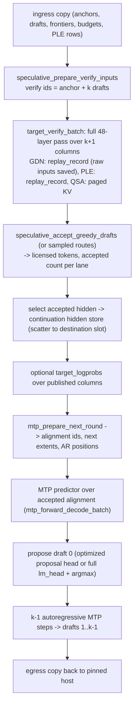

Key design ideas:

- **Verification is exact.** The target model runs over all `k+1` columns in one pass; only tokens that
  agree with the target's own choice (greedy) or pass the sampled acceptance route are licensed. Drafting
  quality affects speed only.
- **GDN and PLE state must be rollback-safe.** Their recurrent state cannot be rewound from a later value.
  ReplaySSM (`docs/maintainer/replayssm-gdn.md`) records the *raw inputs* of each verify step and, once the
  accepted length is known, replays only the accepted prefix from the committed checkpoint to produce the
  next round's state. The fold must execute the same finite-precision transition as verify (not an
  algebraically equivalent formula) or state drifts across rounds.
- **The MTP layer** reuses QSA, HyperConnection and MoE mathematics with its own weights and KV; Flash-Next
  MTP carries a four-stream predictor hidden state distinct from the collapsed hidden used by the target head.
- **Draft head:** an optional 147,456-row indexed proposal head supplies draft candidates; final
  verification always uses the full output head.
- DFlash/DFlash2 (Qwen3.5 only) use the same Program-internal position: a separate draft backbone
  conditioned on target features, verified in the same transaction (`docs/maintainer/dflash.md`).

Engine-visible effect of speculation is only `row_counts` in the `PendingBatch` (accepted tokens per row);
scheduling and publication are unchanged, and when a stop truncates a multi-token round the Engine commits
the exact accepted target prefix so a following turn can still reuse it.

### 9.4 CUDA Graph discipline

`DecodeGraphDefinition` (capture) → `DecodeGraphExecutable` (instantiate/update/upload/launch). Rules the
code follows: no allocation or host-memory reference inside capture (hence device `fill_i32` for valid
columns, since a no-speculation replay once read freed host memory), stable State/KV mapping within a unit,
capture bodies shared with the eager path (`capture_graph` / `run_prepared` wrap the same lambda), and a
diagnostic mode (`NINFER_FLASH_NEXT_LOGITS_DIR`) that must run with `--no-cuda-graph` because it copies
synchronously.

### 9.5 Sampling and output semantics

Sampling parameters are resolved in the Engine from model defaults plus request overrides
(`runtime/contract/sampling.cpp`); sampling itself is device-side (`ops/sampling`). The Frontend's
`OutputSession` owns stop strings, thinking/content channel split, detokenisation, tool-call parsing and
the *prefix-execution boundary* (a position inside the accepted span where model-history reconstruction
gains a split). Forced control (for example closing a thinking budget) uses the same commit path but takes
its tokens from the Frontend and does not advance the sampling RNG.

---

## 10. The Op layer

### 10.1 Layering

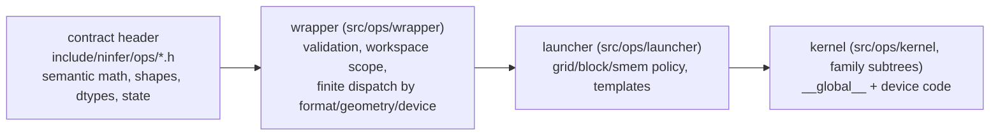

- An Op is admitted when it is a **semantically closed** operation (fused, fixed-shape and
  device-specialised forms all qualify); ownership follows the mathematical contract, not the first caller.
- The wrapper must not dispatch on target key, tensor name, weight role or Program phase; it dispatches on
  semantic variant, format, geometry, extent, state dtype, execution envelope and device capability.
- Launcher headers are private. Models, tests and benchmarks use only the contract headers.
- Larger families own vertical subtrees, e.g. `src/ops/linear/{bf16,fp8,q4,q5,q6,q8,nvfp4}`,
  `softmax_attention/{dense,qsa,sliding_window}`, `linear_attention/{gated_delta_net,kimi_delta_attention}`,
  `sparse_moe/{decode,prefill,small_t,flash_next}`.
- Weight formats consumed directly (no dequantise-then-GEMM stage in the API): BF16, FP8 E4M3 row-scaled,
  NVFP4 (block scale k16, per-expert divisors), Q4/Q5/Q6/Q8 groupwise. Activation permission on the Use
  (`A16Only`, `AllowA8`, `AllowA4`) selects between A16 MMA and quantised-activation routes.

### 10.2 The Flash-Next Op set

`hyperconnection_{repeat,mix,combine,combine_mix}`, `flash_next_qsa` (+ `_select_indices`),
`flash_next_gdn` (+ `_batch_update`, `_replay_record`), `flash_next_moe` (NVFP4 W4A4 expert kernel and a
grouped BF16 GEMM), `flash_next_ple` (+ replay/batch forms), plus shared Ops (`linear`, `rmsnorm`, `rope`,
`sigmoid_mul`, `residual_add`, `embedding`, `argmax`, sampling, speculative-round and `mtp_round` Ops).
Closed mathematical kernels remain shared Ops only where their contracts genuinely coincide across
families.

### 10.3 Qualification rule

Every floating-point Op has one independent naive FP32/FP64 oracle that evaluates the complete logical
formula from public inputs (for packed weights, decoding the signed code with the stored scale). It does not
copy the production kernel's staging casts or reduction tree. Production kernels may choose any
intermediate precision unless it is an observable output, explicit cast, codec value or specified state.
Performance evidence follows a route-development transaction in `op-development.md` (the repository gate
quoted by the fork's plan: at least 2% faster with a positive 95% interval where claimed, no single-request
regression above 2%).

---

## 11. Serving layer

### 11.1 Endpoints and translation

`HttpServer::register_routes` registers: `GET /health`, `GET /v1/models[/{id}]`, `POST
/v1/chat/completions`, `POST /v1/responses` (+ `/input_tokens`, `/compact`, `/{id}/cancel`,
`GET|DELETE /{id}`, `GET /{id}/input_items`), `POST /v1/messages` and `POST /v1/messages/count_tokens`.
Optional CORS headers and bearer / `x-api-key` authentication (`/health` and CORS preflight exempt) are applied in the pre-routing handler.

Flow per request: protocol adapter (`openai_*`, `anthropic_*`) → wire-independent
`serve::GenerationRequest` → `translate.cpp` → public `PromptInput` + `RequestOptions` →
`GenerationService::prepare` (media acquisition, `Engine::prepare`, synchronous `Engine::submit`) →
`GenerationService::run` (aggregate or streaming). Errors travel as `ApiError` mapped from `RequestError`
kinds. OpenAI Responses keeps a bounded local response store (`openai_responses_store`). A JSONL request log
records phase timings, cache path and speculative statistics.

### 11.2 Behaviour that is intentionally limited

- Tool calls are rendered into the prompt and parsed from output; NInfer does not execute tools.
- **No constrained decoding.** `response_format` and `tool_choice` (fork addition) are prompt-guided; a
  leading system block carries the instruction and `json_output::extract` returns the first well-formed JSON
  object/array after dropping whitespace, closed think blocks, fences and prose. Streamed JSON arrives as one
  cleaned chunk. The fork's structured-output probe (I6) measured 179/180 valid outputs, but this is
  observation, not a guarantee.
- Per-token logprobs are optional (`--token-logprobs`); the fork measured about 1% decode cost for the flag
  and about 3.2% for top-5.

---

## 12. Memory model: discrete GPU versus GB10

```text
Discrete (RTX 5090 / PRO 6000)                 GB10 (this fork's target)
┌────────────┐   PCIe   ┌──────────────┐       ┌───────────────────────────────────────────┐
│ device HBM │◄────────►│ host DRAM    │       │ one LPDDR5X pool (~121 GiB, ~246 GB/s read)│
│ weights,KV │          │ page cache,  │       │ weights + KV + state + host tiers + page   │
│ state,work │          │ PLE mapping, │       │ cache + PLE mapping share it               │
└────────────┘          │ pinned tiers │       └───────────────────────────────────────────┘
                        └──────────────┘
```

Consequences implemented or decided in this fork:

- **Sizing:** `cudaMemGetInfo` counts only physically free memory, but `cudaMalloc` reclaims clean page cache
  (probe: 104 GiB allocatable with 10 GiB reported free). Start-up therefore uses
  `MemAvailable − (6 GiB + pinned Host KV)` on integrated devices (`device.props.integrated`). Recorded
  follow-up in the plan: automatic KV sizing can now grow into page cache that holds the PLE table, so a host
  reserve for the PLE working set may be needed.
- **Synchronisation:** yield-style waits measured +1.6–3.3% decode versus blocking (plan, PR #11).
- **Host tiers** save no memory and cost copies; prefer Device slots.
- **PLE residency:** the file-mapped table produced 0 major faults over 256 decode tokens after an 8K
  prefill (block E), while cold prefill was 2.1× slower (page-in).
- **CPU placement:** pinning the server to the ten Cortex-X925 cores measured ≈ 0 cost/benefit for NInfer.

---

## 13. GB10 fork status and measured results

All values below come from `docs/maintainer/plan-2026-09-gb10.md`, quoted with its own caveats; they were
measured on the fork owner's GB10 workstation, not for this document.

| Topic | Result as recorded |
|---|---|
| Build / conformance | Clean build on CUDA 13.0.88 (`-DCMAKE_CUDA_ARCHITECTURES=121a`); op conformance 36 pass / 4 skip; Block I0 ctest 139/139 (11 skips); 4K perplexity 3.998124 |
| Dense FP8 gate (7a) | +0.29% perplexity at 64K, flat drift, acceptance and TEB unchanged; FP8 linears 1.5–2.0× faster than BF16 at fp8proj shapes |
| Decode (fp8proj, bench corpus) | MTP K=3 68.9 / 66.7 tok/s at 8K / 64K; K=2 60.9 / 58.7; no speculation 32.5 / 31.4 |
| Served decode-only (fp8mtp, I2) | 31.4 / 42.0 / 45.5 / 47.0 tok/s at K = 0 / 1 / 2 / 3; host exposure 0.9–3.2 ms per round, so serving overhead is not a lever |
| Acceptance | K=2 0.637, K=3 0.549 on served corpus (deterministic); repetitive fixtures inflate K=3 by ≈ 25% — the plan moved MTP speed rows to a natural-text corpus |
| Prefill | 2,528 tok/s peak at 8K, within 5% out to 64K (fp8proj) |
| Context scaling | K=0 flat (≈ 31–33 tok/s) from 1K to 128K; K=3 shows an unexplained 32K dip (37.7) and 128K rebound (60.8) |
| Decode-verify attribution (K=3) | `moe.nvfp4` 43.6%, `gdn.record` 18.9%, `hyper.combine_mix` 10.0%, `qsa.select` 8.8%, `ple.record` 2.2% |
| Concurrency (I4) | N ≤ 4 aggregate up with K=3 (38.2 tok/s at N=4); **N=8 at K=0 fails** (see below) |
| Reference points quoted | DGPP 24.3 → 32.7 tok/s no MTP (BF16 → FP8 dense), 42–61 with MTP; llama.cpp 24.5; vLLM 43.9 with MTP (third-party numbers, as recorded) |

**Open items the plan records as unresolved (2026-09-30):**

1. **K=0, MC=8 concurrency failure.** N=4 distinct requests at the current auto pool, or N=8 at the old pool,
   trip the worker invariant `StateImage Fork settlement overlaps a resource transaction`; the Engine then
   returns 503 until restart. K=2/K=3 pass the full matrix. Earlier fix `66744eb` addressed a different
   invariant (`selected pressure target could not be sealed`). This item held campaign phase I9.
2. **I0 incomplete** until real and fault tests run on a tree with the memory-sizing fix.
3. **I5 32K/128K MTP anomaly** unexplained.
4. **Automatic KV sizing headroom** default 0 on integrated devices needs a PLE/host reserve decision.
5. Planned but not done: fused hyper-mix (estimated ≈ 10% of K=3 decode-verify), BF16 GDN state (7e, GDN
   recording is 18.9%), constrained decoding for `tool_choice: required`, NVFP4 for remaining dense
   projections (7b), dynamic draft length.

---

## 14. Verification and tooling map

| Area | Location | What it protects |
|---|---|---|
| Op oracles | `tests/ops/`, `tests/CMakeLists.txt` | Numerical correctness at real shapes |
| Engine / scheduler / resource | `tests/test_admission_policy.cpp`, `test_resource_manager.cpp`, `test_kv_capacity.cpp`, `test_context_cost*.cpp` | Admission, backfill, catalog and cost logic |
| Artifact | `tests/artifact/`, `tests/convert/`, `tests/test_layout.cpp` | Framing, binding, conversion |
| Serving | `test_openai_schema.cpp`, `test_anthropic_schema.cpp`, `test_openai_responses*.cpp`, `test_http_*` | External protocol contracts |
| Real-artifact tests | `tests/models/` (skipped without artifacts) | Whole-route behaviour, fault injection (`NINFER_ENGINE_FAULT_INJECTION`) |
| Op benchmarks | `bench/ops/*.cu` | Operator-level performance claims |
| Engine benchmarks | `bench/inference/ninfer_bench.cpp`, `tools/bench/*` | Schedule/request-phase claims; serve TTFT/concurrency/corpus drivers |
| GB10 campaign | `tools/gb10/*` (`step0…step3`, `block_i.sh`, probes) | Fork's measured decisions |

The repository's rule (AGENTS.md): use the smallest evidence that supports the claim; an op micro-benchmark
supports only an op-level claim; profile end-to-end before attributing to a kernel.

---

## 15. Comparison worksheet

Use this table when contrasting with another engine (vLLM, SGLang, llama.cpp, TensorRT-LLM, ExLlamaV3,
DGPP, …). The NInfer column is filled from this document; the "other engine" columns are intentionally
blank and should be filled from that engine's source or documentation, not from memory.

| # | Axis | Question to ask of the other engine | NInfer answer | Section |
|---|---|---|---|---|
| 1 | Model generality | Generic graph/registry, or per-model hand-written schedule? | Closed set, per-family hand-written schedules, no graph | 5.1 |
| 2 | Weight pipeline | Load HF/GGUF and convert at load, or pre-encoded container? | Pre-encoded v3 container; no runtime repack | 4.1 |
| 3 | Quantised compute | Dequantise-to-BF16 or native low-precision MMA? Activation quantisation? | Native per-format routes; Use-level activation permissions | 10.1 |
| 4 | Batching model | Continuous batching, chunked prefill mix, preemption? | ≤ 8 lanes, FIFO, no preemption, one prefill chunk XOR one decode round, alternating | 7.1 |
| 5 | Scheduler scope | Where do priority/QoS live? | None by contract | 1.4 |
| 6 | KV layout | Block size, quantised KV, shared pool, per-seq contiguous? | 64-token typed pages, shared pool, BF16/FP8 (+INT8/NVFP4/K8V4 on Qwen3.5) | 8.1 |
| 7 | Recurrent state | How are SSM/GDN states cached/rolled back? | StateImage slots; ReplaySSM record-then-replay | 8.2, 9.3 |
| 8 | Prefix cache | Hash-of-blocks vs exact-frontier checkpoints? Host tier? | Exact-frontier checkpoints (KV+state), cost-model retention, Device/Host replicas | 8.2 |
| 9 | Speculation | Draft model / MTP / n-gram? Verification exactness? Batch interaction? | MTP + DFlash, in-Program, exact verification | 9.3 |
| 10 | Graph capture | CUDA Graph granularity and keys? | Exact-B graphs; request ids/page ids are inputs | 9.2, 9.4 |
| 11 | Memory planning | Static preallocation or dynamic allocators? | All big allocations before first request | 4.2, 8.1 |
| 12 | Concurrency model | Threads owning GPU state? | One mutation-owner worker thread | 6.1 |
| 13 | Failure semantics | OOM/invariant policy | OOM → retryable + backoff; invariant → engine-wide failure | 7.4 |
| 14 | Numerical qualification | Reference oracles per kernel? | Independent naive oracle per Op | 10.3 |
| 15 | API surface | OpenAI/Anthropic parity; structured output mechanism | OpenAI Chat/Responses + Anthropic; prompt-guided JSON | 11 |
| 16 | Hardware assumptions | Portability vs single-target tuning; unified memory | `sm_120a`/`sm_121a` only; integrated-memory sizing | 12 |
| 17 | Performance evidence | Bench corpus realism (acceptance), decode-only vs wall rate | Explicit scopes; natural corpus for MTP after I2 | 13 |

Suggested measurable comparisons (same GPU, same weights format where possible): decode-only tok/s at
K = 0 and best K on natural text; time-to-first-token at 8K/64K; aggregate tok/s at N = 1/2/4/8 requests;
memory after load per format; prefix-hit TTFT on multi-turn chat; acceptance rate distribution; and the
served-versus-bench gap. Use decode-only rates against decode-only rates — the fork's own review found an
earlier "20–30% behind DGPP" claim compared a wall rate with an engine rate.

---

## 16. Open questions and things not verified

Read-through gaps and discrepancies, so a reader does not mistake them for facts:

1. **PLE placement wording.** `qwen3.8-flash-next-125b-a6b-model.md` says PLE is applied "between its token
   mixer and MoE" at layer 1; `run_flash_next_layers` applies PLE to the HyperConnection stream state at the
   head of layer 1's step (before that layer's token-mixer mix). Not resolved here; the code is the behaviour.
2. **Graph capture timing.** The docs say graph resources exist before requests are accepted; this document
   did not trace exactly which profiles are captured at `create_program` versus warmup.
3. **Qwen3.5 Program internals** (planning/transactions/storage) were read at the documentation and
   interface level, not line by line; Flash-Next was read in more depth.
4. **Vision, sampling kernels, cost-model search and serve translation** are described from headers,
   documentation and structure, not from a full trace.
5. **All performance numbers** are the fork plan's own reports (including a workstation this author cannot
   inspect) and were not reproduced.
6. Upstream documents in `docs/maintainer/` are partly Chinese (normative) with English clarification
   sections; interpretations of them here follow the English maps and code.
7. The fork's plan is a temporary document by its own header; results may move to
   `docs/performance/qwen3.8-flash-next-125b-a6b.md` and this section should then be re-based.

---

## 17. Sources and evidence status

Code read directly: `include/ninfer/engine.h`; `src/runtime/engine/{engine.cpp, engine_core.h (worker loop,
admission, commit, prefill/decode/control runners, failure paths), scheduler.h, request_record.h,
model_instance.{h,cpp}, admission_policy.h}`; `src/runtime/contract/{execution.h, request.h, resources.h}`;
`src/models/registry.h`; `src/models/qwen3_8_flash_next_125b_a6b/export/.../package.h`;
`src/models/qwen3_8_flash_next/impl/runtime/{text_context_impl.h (layer schedule, MTP forward, prefill),
mtp_impl.h, speculative_target_impl.h, schedule.h}`; `src/models/qwen3_8_flash_next/impl/ple_table.h`;
`src/models/qwen3_8_flash_next/export/.../state_image.h`; `src/core/{arena.h, decode_graph.h, device.cu}`
(sync mode); `src/artifact/materializer.h`; `include/ninfer/ops/{flash_next_moe.h, flash_next_gdn.h,
flash_next_qsa.h}`; `src/serve/{http_server.cpp, generation_service.h, json_output.h, request.h}`;
`CMakeLists.txt`, `src/*/CMakeLists.txt`.

Documents used: `README.md`, `AGENTS.md`, `docs/serving.md`, `docs/cli.md`,
`docs/maintainer/{engine-architecture, resource-scheduling-and-context-cache, paged-kv-cache,
artifact-container, op-development, qwen3_5-model, qwen3.8-flash-next-125b-a6b-model,
qwen3.8-flash-next-125b-a6b-artifact, replayssm-gdn, dflash, plan-2026-09-gb10}.md`.

Related references for deeper dives: engine control plane → `engine-architecture.md`; context cache
planning → `resource-scheduling-and-context-cache.md`; KV physical contract → `paged-kv-cache.md`; artifact
format → `artifact-container.md`, `storage-layouts.md`, `tensor-formats.md`; Op rules → `op-development.md`;
Flash-Next mathematics and binding → the two `qwen3.8-flash-next-125b-a6b-*.md` files; speculative state →
`replayssm-gdn.md`, `dflash.md`.

---

## Appendix A. Glossary

| Term | Meaning |
|---|---|
| Active / lane | An admitted request occupying one of 1–8 engine lanes |
| Backfill | Admitting a later FIFO request while the head is blocked, only under a proof that the head is not delayed |
| Checkpoint | Immutable full continuation (State + KV + backend) at an exact token frontier |
| Continuation | The writable state of an active sequence |
| GDN | Gated DeltaNet linear-attention layer with a recurrent state |
| HyperConnection | Learned mixing of 4 residual streams around each block (Flash-Next) |
| MTP | Multi-token-prediction draft layer used for self-speculation |
| PendingBatch | Move-only provisional result of one model unit awaiting commit/abort |
| PLE | Per-layer embedding table lookup by hashed n-gram ids (Flash-Next, file-mapped) |
| Program | Model-instance physical execution owner (state, KV, graphs, transactions) |
| QSA | Flash-Next sparse-selected attention (indexer picks 2051 keys) |
| ReplaySSM | Record raw GDN inputs during verify; replay accepted prefix afterwards |
| Resource revision | Monotonic counter binding plans/proofs to a stable physical topology |
| StateImage | Fixed-size per-sequence recurrent/auxiliary state block, Device or Host |
| Use | One read of a parameter, with an activation-permission set |

## Appendix B. Directory map

```text
include/ninfer/          public Engine interface (engine.h, types.h) + internal Op contracts (ops/)
src/core/                tensors, arenas, layouts, paged KV containers, graph RAII, device context
src/artifact/            v3 reader, binder primitives, materializer
src/ops/                 semantic Ops (wrapper / launcher / kernel + family subtrees)
src/models/qwen3_5/      Qwen3.5 family: config, load, frontend, execution, program, state
src/models/qwen3_8_flash_next/           Flash-Next family runtime (frontend, Program<Variant>, state)
src/models/qwen3_8_flash_next_125b_a6b/  fixed 125B package: config, binder, LoadedModel, leaves
src/runtime/             Engine facade, EngineCore, Scheduler, ResourceManager, cost model, contracts
src/serve/  src/product/ HTTP gateway, protocol adapters, prompt input, media acquisition, logging
src/media/  src/text/    media decode, Jinja/unicode
apps/                    ninfer, ninfer-serve, ninfer-perplexity
bench/  tests/  tools/   benchmarks, tests, converters/artifact IO/campaign scripts (tools/gb10)
docs/                    public docs + maintainer references
```
